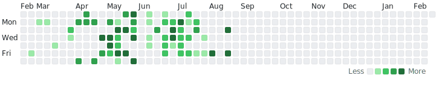

<h2 align="center">My Birding Stats</h2>

Number of bird species I've seen per day

  <picture>
    <source media="(prefers-color-scheme: dark)" srcset="./assets/dark.svg">
    <source media="(prefers-color-scheme: light)" srcset="./assets/light.svg">
    
  </picture>

<!-- ## Projects I've contributed to
Raycast: Added [VSCodium](https://github.com/VSCodium/vscodium) support to a extension. https://github.com/raycast/extensions/pull/2409 -->
