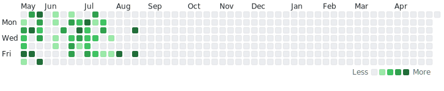

<!--# Hello I'm Avery 👋 -->

<h1 align="center">🕊️</h1>

<!--I am a big birder and try to spend all of the time I can outdoors. My favorite bird is the [Tree Swallow](https://www.allaboutbirds.org/guide/Tree_Swallow/overview); They move in such a majestic way in the air and when the light catchest their pearlescent back, it's breathtaking.

  -->

  <h3>Bird species seen per day</h3>
  <picture>
    <source media="(prefers-color-scheme: dark)" srcset="./assets/dark.svg">
    <source media="(prefers-color-scheme: light)" srcset="./assets/light.svg">
    
  </picture>

<!-- ## Projects I've contributed to
Raycast: Added [VSCodium](https://github.com/VSCodium/vscodium) support to a extension. https://github.com/raycast/extensions/pull/2409 -->
